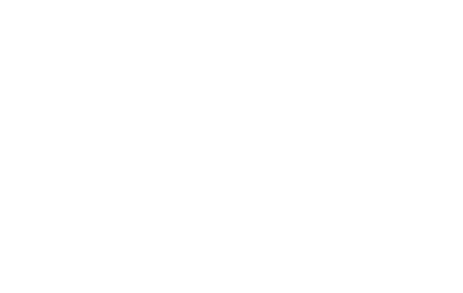

<!-- .slide: data-background-image="assets/lca2019-slide-template.png" data-background-size="contain" -->

### Finite state machines: <br> a design pattern for FPGAs and React
<!-- .element style="font-weight: normal; padding-top: 9vh" -->

<small style="margin-top: 7vh; font-size: x-large">Tessa Bradbury | @tessereth</small>


### Who am I?


### React?

```js
Greeting = ({ name }) => (
  <p className="awesomest-font">
    Hello {name}! Welcome to LCA!
  </p>
)
```
<!-- .element: class="fragment" -->
```js
<Greeting name={currentName}/>
```
<!-- .element: class="fragment" -->


### FPGA?

Field Programmable Gate Array <!-- .element: class="fragment" -->

<!-- image? -->

```verilog
always @(posedge sysclk) begin
  red_led <= ~red_led
end
```
<!-- .element: class="fragment" -->

```
# sysclk=sysclk
NET "sysclk" LOC = "C9";
# led_5=red_led
NET "red_led" LOC = "D11" | IOSTANDARD = LVTTL | SLEW = SLOW | DRIVE = 8;
```
<!-- .element: class="fragment" -->


### Finite state machine?

1. A finite set of states <!-- .element: class="fragment" -->
2. An initial state <!-- .element: class="fragment" -->
3. A transition function <!-- .element: class="fragment" -->
4. A mapping from state to outputs* <!-- .element: class="fragment" -->

\* Not part of official definition <!-- .element: class="fragment" -->


### Show me!


### Traffic lights


Transition function --- Javascript
```js
function reducer(state = initialState, action) {
  if (action.type === UPDATE_LIGHTS) {
    if (state === RED) {
      return GREEN
    } else if (state === GREEN) {
      return YELLOW
    } else if (state === YELLOW) {
      return RED
    }
  } else {
    return state
  }
}
```


Transition function --- Verilog
```verilog
always @(*) begin
  if (update_lights)
    case(state)
      `RED:
        next_state = `GREEN;
      `GREEN:
        next_state = `YELLOW;
      `YELLOW:
        next_state = `RED;
    endcase
  else
    next_state = state;
end
```


Outputs

```js
TrafficLight = function(state) {
  return (
    <div>
      <Light colour="red"    lit={state == RED}/>
      <Light colour="yellow" lit={state == YELLOW}/>
      <Light colour="green"  lit={state == GREEN}/>
    </div>
  )
}
```

```verilog
assign main_red_light    = state == `RED;
assign main_yellow_light = state == `YELLOW;
assign main_green_light  = state == `GREEN;
```


### Intersections
 


<!-- .slide: data-transition="slide-in none-out" -->


<!-- .slide: data-transition="none-in slide-out" -->


### So... what?

# 🤷‍


### Without state



### With state


