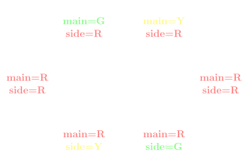
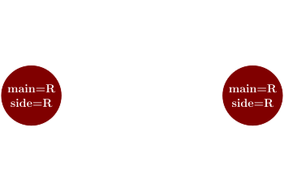

<!-- .slide: data-background-image="assets/lca-title-background.png" data-background-size="contain" -->

### Finite state machines:   A design pattern for FPGAs and React
<!-- .element style="font-weight: normal; padding-top: 5vh" -->

<small style="margin-left: 30vw; margin-top: 6vh; font-size: x-large">Tessa Bradbury</small>

### Traffic lights

<!-- .slide: data-transition="slide-in none-out" -->

<!-- .slide: data-transition="none-in slide-out" -->

