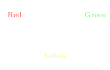
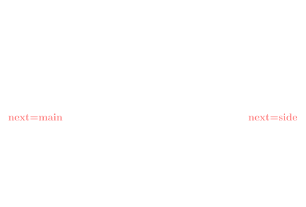

<!-- .slide: data-background-image="assets/lca2019-slide-template.png" data-background-size="contain" -->

### Finite state machines: <br> a design pattern for FPGAs and React
<!-- .element style="font-weight: normal; padding-top: 9vh" -->

<small style="margin-top: 7vh; font-size: x-large">Tessa Bradbury</small>

Note:

* Hi everyone!
* Talk about FSM
* But first some background


### Why this topic?

Note:

* Formal methods
    * automata theory
    * Regular expressions
    * Turing machines
    * Fun not practical
* Digital systems and microprocessors
    * Crossover COMP electrical eng
    * FPGA
    * Verilog
    * Use FSM
    * Different point of view
* Workforce
    * Server/client
    * Were states
    * Low value strategic FSM
    * CRUD web app
* Bugcrowd, React
    * State based
    * Do stuff -> update state -> update view
    * Redux
    * I know what this is!
* As talk to people
    * React -> FSM


### React?

```js
Greeting = ({ name }) => (
  <p className="awesomest-font">
    Hello {name}! Welcome to LCA!
  </p>
)
```
<!-- .element: class="fragment" -->
```js
<Greeting name={currentName}/>
```
<!-- .element: class="fragment" -->

Note:

* Eclectic group here
* Briefly react, FPGAs before FSM
---
* Javascript framework
* Dynamic websites, easier, less errors, consistent
* Components, arguments -> markup
* Virtual DOM
* As author, don't care how changes actual page


### React state

```js
class Greeting extends React.Component {
  state = { name: '' }
  
  updateName = event => {
    this.setState({ name: event.target.value })
  }
  
  render() (
    <div>
      <label for="name">Name</label>
      <input id="name" onChange={this.updateName}/>
      <Greeting name={this.state.name}/>
    </div>
  )
}
```

Note:
* Can store state in component
* Update on events
* Use state for outputs


### FPGA?

Field Programmable Gate Array <!-- .element: class="fragment" -->

<!-- image? -->

```verilog
always @(posedge sysclk) begin
  red_led <= ~red_led
end
```
<!-- .element: class="fragment" -->

```
# sysclk=sysclk
NET "sysclk" LOC = "C9";
# led_5=red_led
NET "red_led" LOC = "D11" | IOSTANDARD = LVTTL | SLEW = SLOW | DRIVE = 8;
```
<!-- .element: class="fragment" -->

Note:

* digital circuit, a bunch of logic gates
* program “in the field” vs manufacture time
    * Think changing CPU instruction set rather than "programs"
* “hardware description language” -- Verilog or VHDL
---
* Explain sysclk
* `red_led` -- 1 bit register
---
* Can store state in reg
* Update on events
* Use state for outputs


### Finite state machine?

1. A finite set of states <!-- .element: class="fragment" -->
2. An initial state <!-- .element: class="fragment" -->
3. A transition function <!-- .element: class="fragment" -->
    * `(state, event) => state`
4. A mapping from state to outputs* <!-- .element: class="fragment" -->

\* Not part of official definition <!-- .element: class="fragment" -->

Note:

* "finite"
    * “tractable”
* initial obvious


### Traffic lights




Note:

* Represents possible states and transition


### What else?

* TCP <!-- .element: class="fragment" -->
* Bug tracker <!-- .element: class="fragment" -->
* Registration wizard <!-- .element: class="fragment" -->
* Games <!-- .element: class="fragment" -->
* ... <!-- .element: class="fragment" -->


### What do these have in common?

* States make sense
* Different behaviour in different states
* Clear transitions between states

Note:

* states make sense -> bug tracker
* Different behaviour -> TCP, write after close
* Transitions -> Games, jump


If FSMs are everywhere, why are they so central to React and FPGAs?

Event orientated systems <!-- .element: class="fragment" -->


### Traffic lights --- deep dive


Note:

* Practical considerations
* Benefits


### Aside: What's the event?

* Some sort of timer <!-- .element: class="fragment" -->
* Platform dependent <!-- .element: class="fragment" -->
* Want to abstract that away <!-- .element: class="fragment" -->

Focus on the transition function <!-- .element: class="fragment" -->

Note:

* Generally want to know event


### React

```js
updateLights = event => {
  this.setState(state => {
    if (state === RED) {
      return GREEN
    } else if (state === GREEN) {
      return YELLOW
    } else if (state === YELLOW) {
      return RED
    } else {
      return state
    }
  }
}
```
<!-- .element: class="fragment" -->s


### Verilog
```verilog
always @(*) begin
  if (update_lights)
    case(state)
      `RED:
        next_state = `GREEN;
      `GREEN:
        next_state = `YELLOW;
      `YELLOW:
        next_state = `RED;
    endcase
  else
    next_state = state;
end
```
```verilog
always @(posedge sysclk) begin
  state <= next_state
end
```


Outputs

```js
TrafficLight = function(state) {
  return (
    <div>
      <Light colour="red"    lit={state == RED}/>
      <Light colour="yellow" lit={state == YELLOW}/>
      <Light colour="green"  lit={state == GREEN}/>
    </div>
  )
}
```

```verilog
assign main_red_light    = state == `RED;
assign main_yellow_light = state == `YELLOW;
assign main_green_light  = state == `GREEN;
```

Note:

* Reminder: state is useful for something


### Intersections
 


Note:

* Not overly enlightening
* fsm not that useful
* More interesting
* Main road, side road
* Could model individually
* Only one green


<!-- .slide: data-transition="slide-in none-out" -->


Note:

* Transition function, based only on state + action


<!-- .slide: data-transition="none-in slide-out" -->


Note:

* Multiple ways to solve
* Lazy, two options, add flag




Note:

* Often get extra data
* Hidden state


Note:

* Production manager, new requirements


### So what does this give us?

# 🤷‍

Note:

* Currently only 1 event
* Justify why, more complicated system


### MOAR FEATURES!

* Pedestrian lights
* Car arrival detection
* Different directions combinations
* ...


### Without state


Note:

Every time you
* Add event -- pedestrian button
    * Consider all outputs
* Add output -- left hand turn arrow
    * Consider all events
* Bugs
* Distributed through codebase
* Verify not breaking every path
---
Figure out how every button press or sensor change on a device
effects every output.


### With state


Note:

* Intermediary
* Add event, only state, not all outputs
* Easier to reason about, easier to test
* In practice, change state
* Worth the work to design state well


Note:

* If state intermediary is the intent, this may not be what we want
* symptom questionable state structure
* state too close to outputs
* Some benefit transitions one place
* Still consider how inputs map to all outputs


Note:

* Just who's turn, what colour
* If main road green, everyone else should be red
* Maybe better
* People may disagree on best structure
---
If you keep practicing modelling your system using finite state machines,
you will eventually find a good fit for your system


### Remember

* Be intentional about your
    * States
    * Events
    * Transitions
* Draw a diagram!

Note:

* Think about what aspects of your system you wish to show


Finite state machines provide a useful abstraction to help us reason
about the complex behaviour of our systems

---
<!-- .element: class="fragment" data-fragment-index="1" -->

There are a lot more similarities between disciplines than you might think
<!-- .element: class="fragment" data-fragment-index="1" -->


### Thank you!

<small>github.com/tessereth/talks</small>
