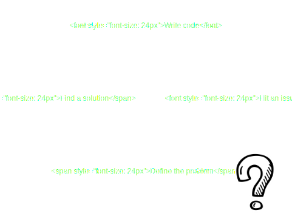
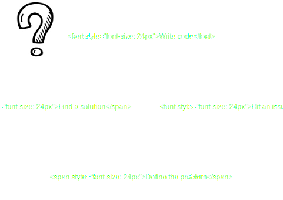

<!-- .slide: data-background-image="assets/lca2019-slide-template.png" data-background-size="contain" -->

### JIT Learning: It's great until it isn't
<!-- .element style="font-weight: normal; padding-top: 13vh" -->

<small style="margin-top: 9vh; font-size: x-large">Tessa Bradbury | @tessereth</small>

### Who am I?

### When should we learn?

### JIT: Just in time

### Just in time learning

Assumption: You will ask the required questions <!-- .element class="fragment" -->

Counter example: Accessibility <!-- .element class="fragment" -->

Assumption: You can figure out what you need to learn <!-- .element class="fragment" -->

Counter example: Race conditions <!-- .element class="fragment" -->

_insert screenshot_

[rails/rails#34310](https://github.com/rails/rails/issues/34310)

Assumption: You can find what you need to know <!-- .element class="fragment" -->

Counter example: Proprietary software <!-- .element class="fragment" -->

Assumption: You know when you've solved the problem <!-- .element class="fragment" -->

Counter example: Statistics <!-- .element class="fragment" -->

Assumption: The benefit of getting it done now out ways the cost of getting it wrong <!-- .element class="fragment" -->

Counter example: Security <!-- .element class="fragment" -->

### So what?

### Just In Time

or

### Upfront?

